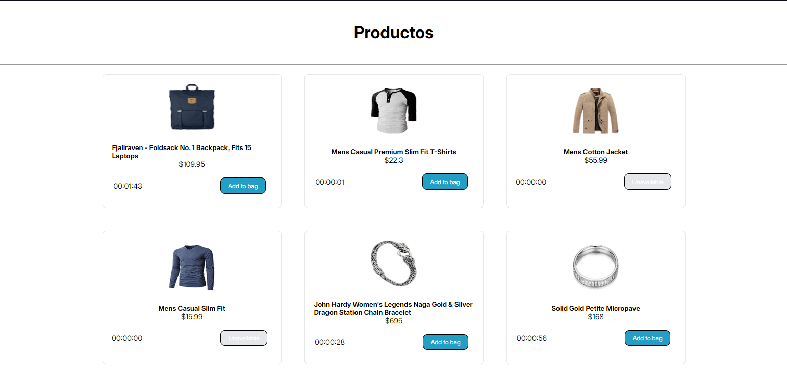

# Make It Real - Aplicación Web con JavaScript Vanilla

This is a solution to the Aplicación Web con JavaScript Vanilla project of the Make It Real course.

## Table of contents

- [Make It Real - Aplicación Web con JavaScript Vanilla](#make-it-real---aplicación-web-con-javascript-vanilla)
  - [Table of contents](#table-of-contents)
  - [Overview](#overview)
    - [The challenge](#the-challenge)
    - [Screenshot](#screenshot)
  - [Our process](#our-process)
    - [Built with](#built-with)
    - [Continued development](#continued-development)
  - [Authors](#authors)
  - [Acknowledgments](#acknowledgments)

## Overview

### The challenge

Create a web application that consumes the [Fake Store API](https://fakestoreapi.com/) and displays products dynamically. The main goal is to list products on the main page and add a timer for each product, which will disable the purchase button when the time runs out.

Each product must be displayed in a card that includes:

- Title
- Image
- Price
- Description
- Category
- Purchase button (with a timer)

Each product will have a random countdown timer (between 1 and 3 minutes).
Once the time runs out, the "Buy" button should be disabled and non-clickable.

### Screenshot

## Our process

1. Semantic HTML Structure

2. Adding Static Page Styling

3. Creating Modules:

4. Implementing Functions

5. Finalizing Styles

### Built with
- Semantic HTML5 markup
- CSS custom properties
- Flexbox
- Mobile-first workflow

### Continued development

Learn more about modules in javascript

## Authors

- Ariana Campos - [linkedin](https://www.linkedin.com/in/ariana-campos-trinidad-563443194/)
- Ariana Campos - [github](https://github.com/Aricatri)

## Acknowledgments

Thanks to Make It Real for the challenge
